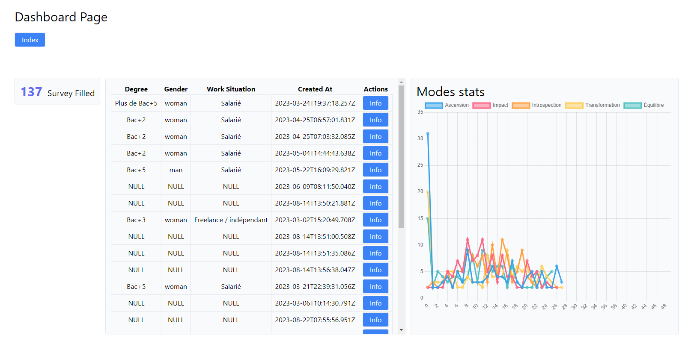
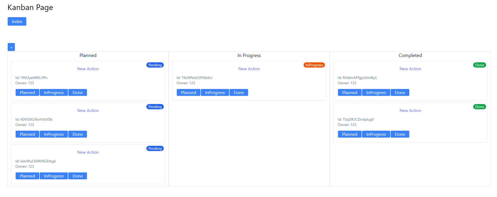

Run the project with `make run`

Use the `pgsql_backup` file to restore Postgres data

Dashboard result

Kanban result

## Time spent

Friday - 2h34
[17h25 - 18h09] 44m - Main Docker Setup
[18h14 - 18h48] 34m - Schema and Entity creation (TypeORM)
[19h50 - 21h06] 1h16 - Managed to import CSV into Postgres

Saturday - 2h48
[11h30 - 12h45] 1h15 - Refactored Postgres Tables
[16h18 - 16h44] 26m - Setup of Mikro ORM instead of TypeORM to generate entities from Database schema.
[19h03 - 20h10] 1h7m - Started to implement Controllers and Services with NestJS

Sunday - 4h17
[10h11 - 13h28] 3h17 - Created Dashboard for Phase 1
[13h28 - 14h24] 50m - Started Kanban Application for Phase 2
[14h24 - 14h34] 10m - Change the card status from Planned, InProgress and Completed

TOTAL = 9h39
